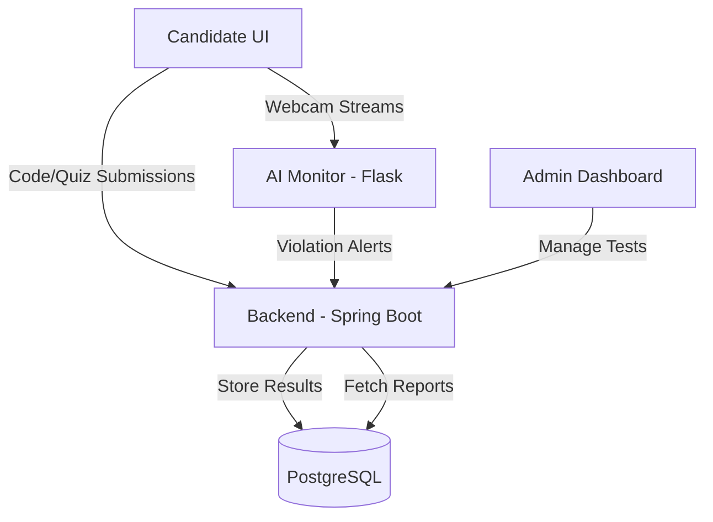

# AI-Powered Proctoring & Automated Assessment System 🚀
### Team: **ILLUSION** | Rajalakshmi Engineering College (REC)
#### Event: **Virtusa Jatayu Season 5 - Stage 2 Submission**

---

## 🌟 Overview
Project **ILLUSION** is a next-generation assessment platform designed to ensure 100% integrity in remote examinations through multi-modal AI monitoring. By seamlessly integrating **Computer Vision** (YOLOv8, MediaPipe) and **Generative AI** (Google Gemini 2.0), the system not only prevents cheating but also automates the evaluation of technical technical competence via real-time code execution and micro-oral interviews.

## ✨ Core Features
- **🤖 Advanced AI Vision Monitor**: Real-time detection of multiple faces, gaze direction, and unauthorized devices (phones, books).
- **🎙️ Micro-Oral Evaluation**: Post-exam technical clarity checks where AI conducts localized interviews based on candidate solutions.
- **📚 AI Question Wizard**: Instantly generate structured assessments (MCQs & Coding) from PDF syllabus documents.
- **🔒 Secure Sandbox**: Enforces fullscreen mode, tab-switching prevention, and copy-paste inhibition.
- **💻 Integrated IDE**: High-performance code editor supporting multiple languages with real-time test case validation.
- **📊 HR Analytics Dashboard**: Comprehensive results reporting with AI-generated behavioral summaries and "Smart Verdicts".

## 🛠 Tech Stack
- **Frontend**: React 18, TailwindCSS, Lucide-React, WebSockets (STOMP)
- **Backend**: Spring Boot 3.2.0, Spring Data JPA, PostgreSQL
- **AI Engine**: Python (Flask), Ultralytics YOLOv8, MediaPipe, Google Gemini 2.0-Flash
- **Sandbox**: Judge0/Piston REST API Integration

## 🏗 System Architecture

## 🚀 Getting Started

### Prerequisites
- Java 17
- Python 3.10+
- Node.js 18+
- PostgreSQL

### Quick Run
1.  **Backend**: `cd backend && mvn spring-boot:run`
2.  **AI Monitor**: `cd ai-monitor && python app.py`
3.  **Frontend**: `cd frontend && npm start`

> [!IMPORTANT]
> Detailed deployment and "How to Run" instructions are available in [Segment 10: Submission Final](documentation_segments/Segment_10_Submission_Final.md).

## 📄 Documentation Segments
The source code is fully documented across 10 specialized segments:
1.  [Architecture Overview](documentation_segments/Segment_1_Overview.md)
2.  [Backend Models](documentation_segments/Segment_2_Backend_Models.md)
3.  [Backend Services](documentation_segments/Segment_3_Backend_Services.md)
4.  [AI Vision Pipeline](documentation_segments/Segment_4_AI_Vision_Pipeline.md)
5.  [AI Oral Evaluation](documentation_segments/Segment_5_AI_Oral_Evaluation.md)
6.  [Frontend Admin](documentation_segments/Segment_6_Frontend_Admin.md)
7.  [Frontend Exam Room](documentation_segments/Segment_7_Frontend_ExamRoom.md)
8.  [Frontend Results](documentation_segments/Segment_8_Frontend_Results.md)
9.  [Security & Compliance](documentation_segments/Segment_9_Security_Compliance.md)
10. [Final Submission Guide](documentation_segments/Segment_10_Submission_Final.md)

---
**Team ILLUSION** | *Innovation with Integrity*  
Rajalakshmi Engineering College (REC)  
Virtusa Jatayu Season 5
