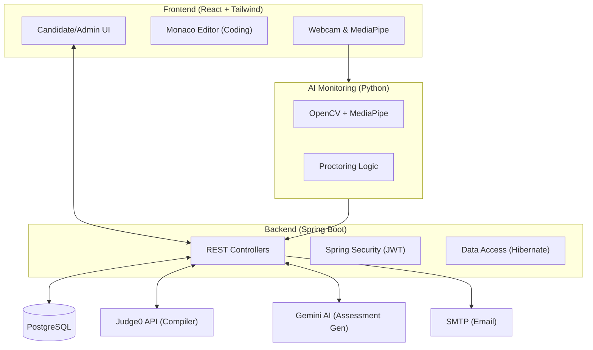

# Project Review Guide: AI Proctoring Platform

This document provides a comprehensive breakdown of the technologies, workflows, and algorithms used in the AI Proctoring Platform.

## High-Level Architecture

---

## 🚀 Frontend Stack

### **React.js & TypeScript**
*   **Why?**: React's component-based architecture is ideal for managing the complex state transitions required for an assessment platform (e.g., moving between instructions, test-taking, and submission). TypeScript adds static typing, which significantly reduces runtime errors in complex logic like proctoring event handling.
*   **Key Feature**: **Monaco Editor integration** allows us to provide a professional-grade coding environment (VS Code style) for candidates.

### **Tailwind CSS**
*   **Why?**: Tailwind enables rapid UI development with a consistent design system. It was specifically used here to implement a modern "Glassmorphic" design and responsive layouts that work across different screen sizes.

### **React Webcam & MediaPipe**
*   **Why?**: These enable client-side video processing. While serious monitoring happens on the server/AI module, initial face detection and camera management are handled here for immediate user feedback.

---

## ⚙️ Backend Stack

### **Spring Boot (Java 17)**
*   **Why?**: Spring Boot is a robust, production-ready framework that offers excellent performance and vertical scalability. 
*   **Spring Security & JWT**: Essential for securing highly sensitive assessment data. JWT (JSON Web Tokens) allows for stateless, secure authentication, ensuring that only authorized candidates can access their specific tests.
*   **Core Libraries**: **Lombok** for clean code, **Spring Data JPA** for seamless database mapping, and **Spring Mail** for automated interview invitations.

---
### **Spring Mail (SMTP)**
*   **Why?**: To automate candidate communication without manual intervention.
*   **What it does**: 
    1.  **Invitations**: Automatically sends a unique exam link to candidates using a **Test Token**.
    2.  **Results**: Sends the final score and recruitment verdict (Selected/Rejected) once the admin approves.
*   **Async Processing**: We use the `@Async` annotation, so the system doesn't "freeze" while waiting for the email to send; it happens fast in the background.

## 🤖 AI & Proctoring Module

### **Python (OpenCV, MediaPipe, TensorFlow)**
*   **Why?**: Python is the industry standard for AI.
*   **OpenCV**: Used for real-time video stream manipulation and frame analysis.
*   **MediaPipe**: Chosen for its high-efficiency face mesh and landmark detection, allowing us to track eye movements and head orientation with minimal latency.

### **Gemini AI (Google DeepMind) & RAG (Retrieval-Augmented Generation)**
*   **Why?**: We use a **RAG (Retrieval-Augmented Generation)** pattern to automate assessment creation. 
*   **What is RAG?**: RAG is a technique that gives the AI specific "outside" information (in our case, your uploaded PDF) to look at *before* generating an answer. 
*   **Detailed MCQ Generation Flow**:
    1.  **Retrieval**: The system uses `PyPDF2` to extract raw technical text from the candidate's uploaded PDF.
    2.  **Context Injection (Augmentation)**: This text is injected into a "System Prompt." We tell the AI: *"You are an expert examiner. Use the following text as your ONLY source of truth: [EXTRACTED TEXT]."*
    3.  **Structured Generation**: The AI (Gemini Flash) analyzes the technical concepts and generates a JSON package containing the question, four options (A, B, C, D), and the correct answer.
*   **The Advantage**: This ensures that even if the AI wasn't initially trained on your specific company documents, it can still generate 100% accurate questions because it is "reading" the document in real-time.

---

## 💾 Infrastructure & Tools

### **PostgreSQL**
*   **Why?**: A powerful, open-source relational database. Its reliability and support for complex JOIN operations are critical for linking candidates, tests, submissions, and proctoring logs.

### **Judge0 API**
*   **Why?**: Executing untrusted code from candidates is a security risk. Judge0 provides a secure, isolated sandbox environment to run code in multiple languages (Java, Python, C++, etc.) and return the results without compromising our main server.

---

## 🔄 Project Operational Flow

1.  **Preparation (Admin)**:
    *   Administrator creates an assessment (Quiz or Coding).
    *   Uses **RAG + Gemini** to generate relevant questions from uploaded PDFs.
    *   Sends email invitations to candidates with unique access tokens.
2.  **Examination (Candidate)**:
    *   Candidate logs in and enters the **Exam Room**.
    *   The frontend activates the **Webcam** and enters **Enforced Fullscreen**.
3.  **Proctoring (AI Monitor)**:
    *   The frontend captures frames and sends them to the **Python AI Service**.
    *   AI analyzes the frame for violations (explained below).
    *   Results are sent back to the frontend and logged in the **PostgreSQL** database.
4.  **Review (Admin)**:
    *   After completion, Admin reviews the **Proctoring Report** which shows time-stamped logs of all suspicious activities.

---

## 🚨 Violations & Consequences

We use a tiered system for handling suspicious behavior:

| Violation | Severity | System Action |
|-----------|----------|---------------|
| **Fullscreen Exit** | HIGH | **Blocking Overlay**: The exam is hidden until the user re-enters fullscreen. |
| **Multiple Faces** | HIGH | **Silent Log**: Logged to database for admin review as high-priority cheating. |
| **Looking Away** | MEDIUM | **Visual Alert**: A small toast notification warns the candidate. |
| **Phone Detected** | HIGH | **Silent Log**: YOLO detection flags mobile device usage. |

---

## 🧠 AI Algorithms: How it Works

### **1. Eye Tracking (Iris Ratio)**
*   **The Math**: We use MediaPipe to find the eye corners and the iris center.
*   **Algorithm**: We calculate the ratio of the iris's horizontal position relative to the eye's width. 
*   **Threshold**: Если the iris moves more than **35%** toward either corner, the algorithm flags the candidate as "Looking Away."

### **2. Head Pose (Yaw & Pitch)**
*   **The Math**: We treat the face as a 3D object. We map the nose tip, chin, and eye outer corners to a geometric plane.
*   **Algorithm**: 
    *   **Yaw**: Measured by the horizontal symmetry of the nose relative to the eyes.
    *   **Pitch**: Measured by the vertical distance between the nose and the chin center.
*   **Threshold**: A turn of >30° (Yaw) or tilt of >25° (Pitch) is logged as suspicious movement.

### **3. Object Detection (YOLOv8)**
*   **The Math**: We use a pre-trained **YOLOv8 nano** model (optimized for CPUs).
*   **Algorithm**: The model scans every frame specifically for **COCO Class 67 (Cell Phone)**. 
*   **Rationale**: Unlike simple color matching, YOLO uses deep learning to recognize the shape and features of a phone, even if it's partially hidden.
