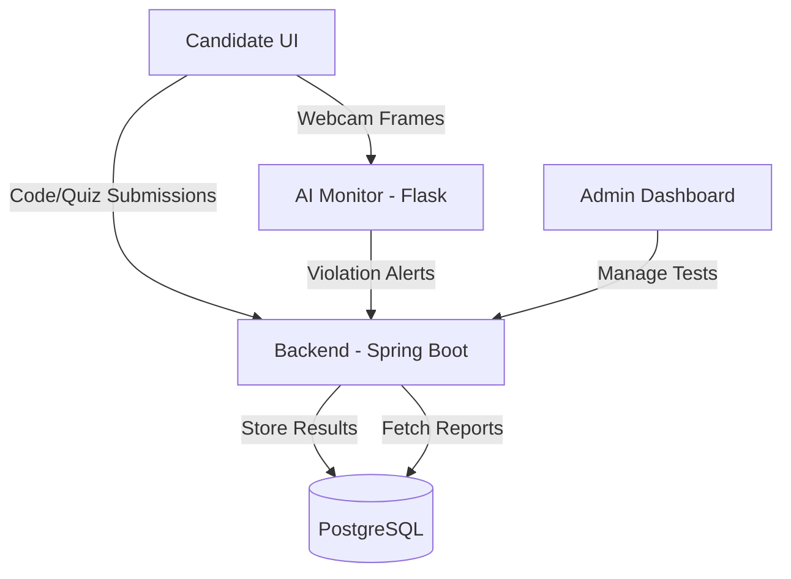

# Segment 1: System Architecture & Modern Technical Stack

This document provides a deep-dive into the architectural foundation of Project **ILLUSION**, an AI-Powered Proctoring and Automated Assessment System built for the **Virtusa Jatayu Season 5** competition.

## 1. High-Level Architecture Overview
The system follows a modern micro-services inspired architecture consisting of three primary layers:
1.  **Frontend (React/Vite)**: A sleek, glassmorphic UI that provides a seamless experience for both administrators and candidates.
2.  **Backend (Spring Boot 3.2)**: The core brain that manages persistent state, security, and complex business workflows.
3.  **AI Monitor (Flask/Python)**: A high-performance computer vision and GenAI service that performs real-time proctoring and automated evaluation.

## 2. Component Interaction Diagram
The following diagram illustrates how data flows between the components during an active assessment session:

## 3. Detailed Technology Stack
We have selected industry-standard tools to ensure scalability and reliability:

### Frontend
- **React 18**: Component-based architecture for the Exam Room and Admin Portal.
- **TailwindCSS**: Premium, responsive styling with custom animation tokens.
- **Lucide Icons**: High-quality iconography for a professional aesthetic.
- **WebSockets (STOMP)**: Real-time screen streaming and status synchronization.

### Backend (Spring Boot)
- **Spring Data JPA**: Efficient ORM for PostgreSQL.
- **Spring Security**: JWT-based authentication for the HR portal.
- **Judge0/Piston Integration**: Sandbox environment for secure code execution.
- **Java Persistence**: Handling complex relationships between Assessments and Questions.

### AI Engine (Python)
- **MediaPipe**: Real-time landmark detection (FaceMesh & Gaze).
- **YOLOv8 (Ultralytics)**: Object detection to find prohibited devices (phones, books).
- **Google Gemini 2.0-Flash**: Generative AI for question creation and micro-oral evaluation.
- **Edge-TTS**: Quality text-to-speech for an immersive, automated interview experience.

## 4. Why This Architecture?
- **AI Offloading**: By separating the AI logic into a Python service, we ensure that the high-CPU computer vision tasks do not impact the responsiveness of the Spring Boot backend.
- **Scalability**: Each layer can be scaled independently during peak assessment hours.
- **Security Checkpoints**: Every submission is validated both at the API level (Spring Boot) and the proctoring level (Flask), ensuring zero-compromise integrity.

---
**Team**: ILLUSION  
**Institution**: Rajalakshmi Engineering College  
**Event**: Virtusa Jatayu Season 5
